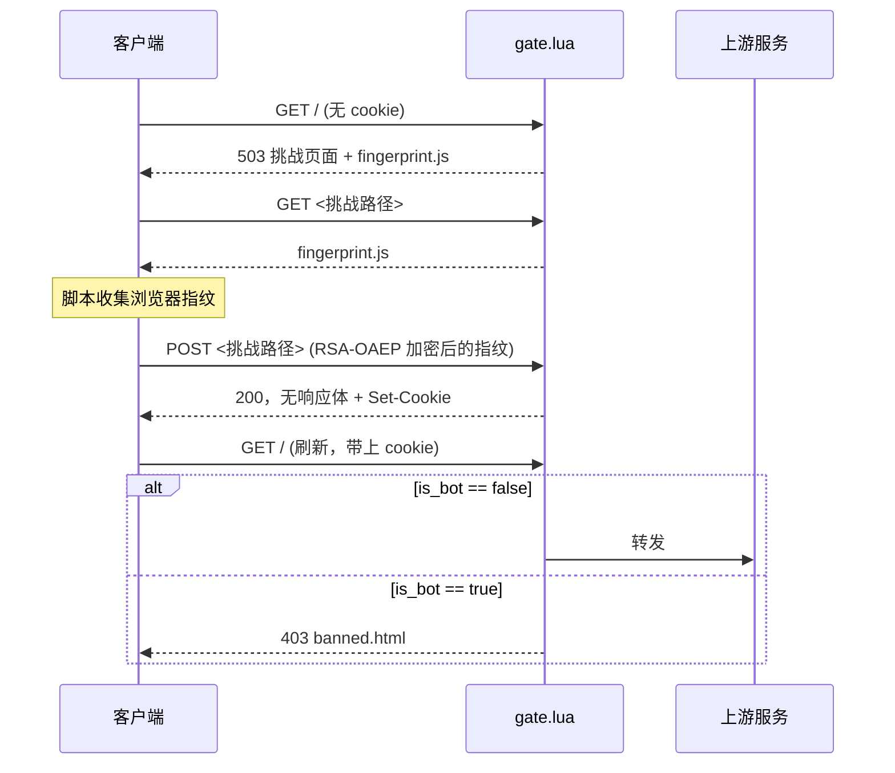

# 🛡️ nginx-basic-bot-detector

基于 OpenResty 的轻量反爬虫过滤器，通过浏览器指纹检测识别自动化客户端。

[English](docs/README.en.md) | [简体中文](README.md)

## ✨ 功能

- 🔍 **规则化自动化检测** — 检查 `cdp`、`webdriver`、`headless`、`selenium`、`phantom`、`puppeteer`、
`playwright` 等信号，并校验指纹脚本版本
- 🔐 **加密指纹上报** — 客户端用 RSA-OAEP 加密指纹数据后再发送，线上抓包不可读
- 🍪 **无状态签名 Cookie** — HMAC-SHA256 签名，判定结果只写入 Cookie，服务端不存 session
- 🚦 **三态响应** — 503 挑战页、200 验证（无响应体）、403 封禁，语义清晰
- 🎯 **隐藏挑战路径** — 由密钥派生，每次部署唯一，无法被固定路径识别
- ⚡ **纯 Lua 实现** — 无需编译模块，无需匹配 nginx ABI，直接运行于标准 OpenResty

## 📦 快速开始

**1. 安装 [OpenResty](https://openresty.org/en/linux-packages.html)**（已自带 LuaJIT、
`ngx_http_lua_module`、`lua-cjson`）——从官方 apt 源安装，而不是发行版自带的 nginx 包：

```bash
# Debian/Ubuntu
wget -O - https://openresty.org/package/pubkey.gpg | sudo apt-key add -
sudo apt-get -y install software-properties-common
sudo add-apt-repository -y "deb http://openresty.org/package/ubuntu $(lsb_release -sc) main"
sudo apt-get update
sudo apt-get install -y openresty
```

再装上唯一的额外依赖：

```bash
opm install fffonion/lua-resty-openssl
```

**2. 把源码放到目标机器上**——`lua/` 和 `templates/` 必须是兄弟目录，克隆到哪里都行，下面的例子放在
`/etc/bot-detector`：

```bash
git clone https://github.com/0xfffb/nginx-basic-bot-detector.git /etc/bot-detector
```

**3. 修改** `/etc/bot-detector/lua/config.lua` 里的 `hmac_secret`——仓库自带的值仅用于本地测试，部署前必须
换成真实密钥：

```lua
-- lua/config.lua
return {
  hmac_secret = "your secret",  -- 必填，无默认值
  cookie_ttl_secs = 3600,
  rsa_private_key = [[ ... ]],
}
```

**4. 把 `lua/`、`templates/` 接入你的 nginx 配置**，将 `gate.lua` 挂到唯一入口 `location /` 上，并配置一个
仅供内部 `ngx.exec` 跳转、负责 `proxy_pass` 到真实后端的 `location`：

```nginx
http {
  lua_package_path "/etc/bot-detector/lua/?.lua;;";

  server {
    listen 80;

    # 内部专用，只能被 gate.lua 的 ngx.exec("@upstream") 跳转命中
    location @upstream {
      internal;
      proxy_pass http://127.0.0.1:8080;
    }

    # 唯一的对外入口，所有请求先经过 gate.lua 判定
    location / {
      content_by_lua_file /etc/bot-detector/lua/gate.lua;
    }
  }
}
```

完整示例见 [`example/nginx.conf`](example/nginx.conf)。

**5. reload nginx。** 没有编译、没有构建步骤——Lua 是解释执行的，每个 worker 通过 `require` 各自加载一份。

## ⚙️ 架构

单一入口 `gate.lua` 驱动整个流程：



## 📄 许可证

[MIT](LICENSE)