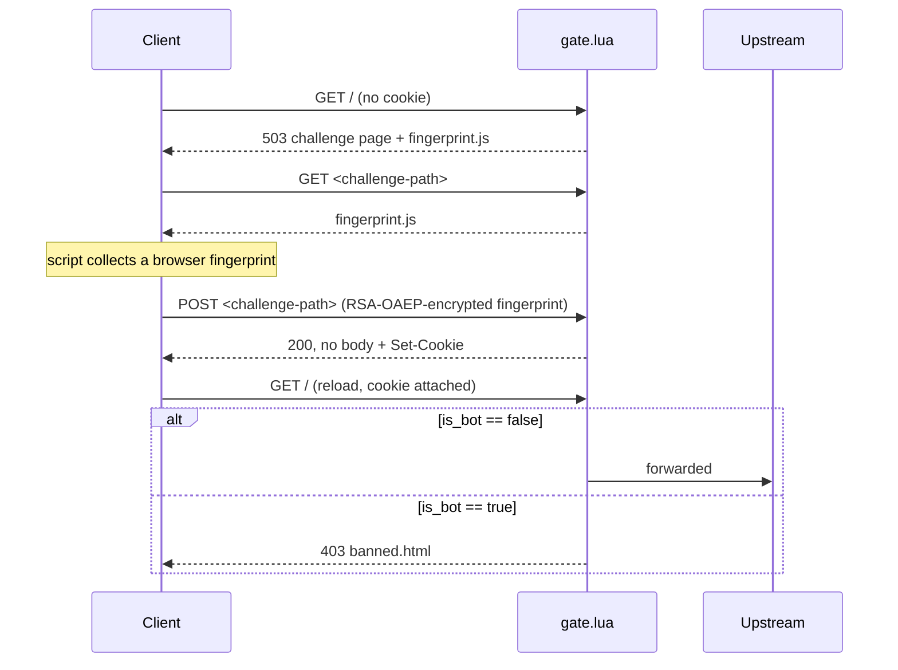

# 🛡️ nginx-basic-bot-detector

A lightweight anti-bot filter for OpenResty that identifies automated clients via browser fingerprinting.

[English](README.en.md) | [简体中文](../README.md)

## ✨ Features

- 🔍 **Rule-based automation detection** — checks `cdp`, `webdriver`, `headless`, `selenium`, `phantom`,
  `puppeteer`, `playwright` signals plus a script-version check; any single match is judged as a bot
- 🔐 **Encrypted fingerprint payload** — the client encrypts its report with RSA-OAEP before sending,
  unreadable off the wire
- 🍪 **Stateless signed cookie** — HMAC-SHA256 signed; the verdict lives only in the cookie, no
  server-side session
- 🚦 **Three-state response** — 503 challenge, 200 verify (no body), 403 ban
- 🎯 **Hidden challenge path** — key-derived, unique per deployment, not a fixed path
- ⚡ **Pure Lua** — no compiled module, no ABI-matching, runs on stock OpenResty

## 📦 Quick start

**1. Install [OpenResty](https://openresty.org/en/linux-packages.html)** (bundles LuaJIT,
`ngx_http_lua_module`, `lua-cjson` already) — from OpenResty's own apt repo, not your distro's stock
nginx package:

```bash
# Debian/Ubuntu
wget -O - https://openresty.org/package/pubkey.gpg | sudo apt-key add -
sudo apt-get -y install software-properties-common
sudo add-apt-repository -y "deb http://openresty.org/package/ubuntu $(lsb_release -sc) main"
sudo apt-get update
sudo apt-get install -y openresty
```

Then add the one extra dependency:

```bash
opm install fffonion/lua-resty-openssl
```

**2. Get the source onto the target machine** — `lua/` and `templates/` must stay siblings; clone it
anywhere you like, e.g. `/etc/bot-detector`:

```bash
git clone https://github.com/<your-org>/nginx-basic-bot-detector.git /etc/bot-detector
```

**3. Change `hmac_secret` in `/etc/bot-detector/lua/config.lua`** — the value shipped in the repo is for
local testing only; swap it for a real secret before deploying:

```lua
-- lua/config.lua
return {
  hmac_secret = "replace-with-your-own-high-entropy-secret",  -- required, no default
  cookie_ttl_secs = 3600,
  rsa_private_key = [[ ... ]],
}
```

**4. Wire `lua/` and `templates/` into your nginx config** — point the single entry point (`location /`)
at `gate.lua`, and add an internal-only location that `proxy_pass`es to your real backend for
`gate.lua`'s `ngx.exec` to forward to:

```nginx
http {
  lua_package_path "/etc/bot-detector/lua/?.lua;;";

  server {
    listen 80;

    # Internal only — reached exclusively via gate.lua's ngx.exec("@upstream")
    location @upstream {
      internal;
      proxy_pass http://127.0.0.1:8080;
    }

    # The single entry point every request hits first, judged by gate.lua
    location / {
      content_by_lua_file /etc/bot-detector/lua/gate.lua;
    }
  }
}
```

See [`example/nginx.conf`](../example/nginx.conf) for a complete example.

**5. Reload nginx.** No compilation, no build step — Lua is interpreted, loaded by each worker via
`require`.

## ⚙️ Architecture

A single entry point, `gate.lua`, drives the whole flow:



Full design rationale and known limitations: [`CLAUDE.md`](../CLAUDE.md).

## 📄 License

[MIT](../LICENSE)
